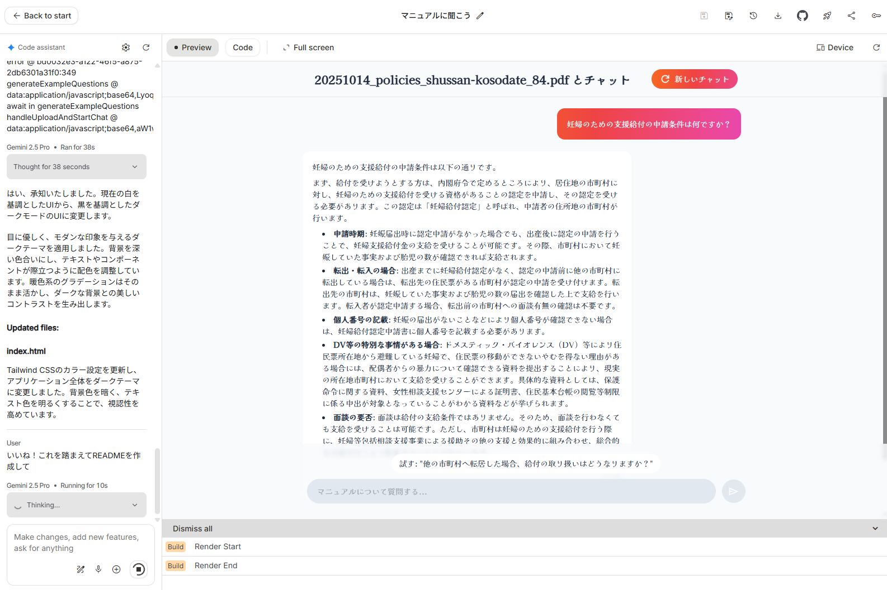

<div align="center">
  <h1>マニュアルに聞こう 📚💬</h1>


  <p>Gemini FileSearch を活用してマニュアルから即座に答えを引き出す、ドキュメント指向チャットアプリです。</p>
</div>

<div align="center">
  
  
  
  
  
</div>

---

## 🧭 目次
- [🗂️ プロジェクト概要](#-プロジェクト概要)
- [✨ 主な機能](#-主な機能)
- [🏗️ アーキテクチャ概要](#️-アーキテクチャ概要)
- [🛠️ セットアップ](#️-セットアップ)
- [🚀 使い方](#-使い方)
- [🔐 環境変数](#-環境変数)
- [🧪 テストと品質管理](#-テストと品質管理)
- [🖼️ スクリーンショット](#️-スクリーンショット)
- [📁 プロジェクト構成](#-プロジェクト構成)
- [📚 追加ドキュメント](#-追加ドキュメント)
- [🤝 コントリビューション](#-コントリビューション)

## 🗂️ プロジェクト概要
「マニュアルに聞こう」は、ユーザーが PDF / TXT / Markdown のマニュアルをアップロードし、Google Gemini の FileSearch 機能を通じて高速に回答を得ることができるチャットアプリケーションです。ダークモードに最適化された UI と柔らかなアニメーションで、長時間の調査でも疲れない体験を提供します。

## ✨ 主な機能
- 📥 **ドキュメントアップロード**: ドラッグ&ドロップまたはファイル選択で簡単アップロード。
- 🧪 **サンプルデータでお試し**: 用意されたサンプルマニュアルを即時読み込み。
- 💬 **チャットインターフェース**: ドキュメントに関する質問を自然言語で対話。
- 🔍 **ソース参照**: 回答の根拠となるチャンクを一覧表示。
- 🎨 **洗練された UI**: Kaisei Decol フォントと暖色グラデーションを採用。
- 🔑 **API キー連携**: ユーザー自身の Gemini API キーを安全に使用。

## 🏗️ アーキテクチャ概要
- フロントエンド: React + TypeScript + Vite
- AI 連携: `@google/genai` SDK による Gemini 2.5 Flash 呼び出し
- 検索基盤: Gemini FileSearch Store での RAG 連携
- UI スタイリング: Tailwind CSS ベースのダークテーマ

詳しいコード構成は [📁 プロジェクト構成](#-プロジェクト構成) を参照してください。

## 🛠️ セットアップ
1. 📦 リポジトリをクローン
   ```bash
   git clone https://github.com/your-org/ask_the_manual.git
   cd ask_the_manual
   ```
2. 📥 依存パッケージをインストール
   ```bash
   npm install
   ```
3. 🔐 環境変数ファイルを準備（詳しくは [🔐 環境変数](#-環境変数)）
4. ✅ 開発サーバーを起動
   ```bash
   npm run dev
   ```

## 🚀 使い方
1. `npm run dev` で開発サーバーを起動し、ブラウザで `http://localhost:5173` にアクセス。
2. 画面上部のプロンプトに従い、Gemini API キーを入力または貼り付け。
3. アップロードゾーンにマニュアルをドラッグ&ドロップ、もしくはサンプルマニュアルを選択。
4. 解析が完了するとチャット画面に遷移。気になる点を質問すると、根拠付きで回答が表示されます。
5. 「新しいチャット」ボタンでセッションをリセットし、別ドキュメントを読み込むことも可能です。

## 🔐 環境変数
`.env` ファイルに以下の値を設定してください。`API_KEY` は **Google Gemini API キー** を使用します。

```env
API_KEY="your-gemini-api-key"
```

> 推奨: `.env.example` を作成してチームと共有し、`.gitignore` に `.env` を追加してください。

## 🧪 テストと品質管理
- ✅ 現在は E2E / 単体テストは未実装です。導入する場合は `npm run test` スクリプトの追加を推奨します。
- 🧭 Vite のビルド整合性を保つため、リリース前に `npm run build` を実行し、バンドルエラーが無いか確認してください。

## 🖼️ スクリーンショット



## 📁 プロジェクト構成
```
ask_the_manual/
├── App.tsx               # ルートコンポーネント
├── components/           # UI コンポーネント群
├── services/             # Gemini FileSearch 連携ロジック
├── index.tsx             # エントリーポイント
├── index.css             # グローバルスタイル
├── types.ts              # 共通型定義
└── vite.config.ts        # Vite 設定
```

## 📚 追加ドキュメント
- `metadata.json`: サンプルマニュアルのメタデータ
- `types.ts`: 型定義とインターフェースの詳細

将来的には `docs/` ディレクトリを追加し、アーキテクチャや API コントラクトの詳細を分割して管理することを推奨します。

## 🤝 コントリビューション
Issue / Pull Request は歓迎です。新規機能提案の際は以下を添えてください。
- 🧾 背景と目的
- 🧪 テスト計画
- 🔐 セキュリティ観点での確認事項

---

<div align="center">
  <sub>Gemini FileSearch × React でマニュアル活用を加速させよう！</sub>
</div>
